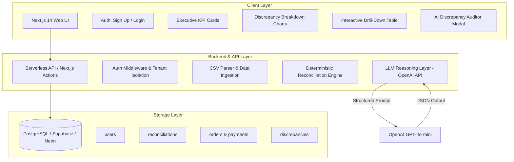

# Financial Reconciliation & Revenue Leakage Dashboard
## Master Project Blueprint & Implementation Guide (24h Take-Home)

---

## 1. Executive Summary & Evaluation Core Motto

### The Core Motto
> **"Can you take messy, conflicting real-world data, build an accurate deterministic engine to discover where the business is losing money, wrap it in a secure, production-ready product, and defend every engineering decision you made?"**

### What Evaluators Are Testing
1. **Data Acumen & Critical Thinking**: Finding the real edge cases without making assumptions or inventing false alarms.
2. **Deterministic System Design**: Strict, code-based financial reconciliation (LLMs must never do the matching).
3. **Product & Business Empathy**: Building an executive dashboard that answers: *How much money is at risk? What categories of problems exist? Which rows should we act on first?*
4. **Pragmatic AI Integration**: Backend-only LLM reasoning, structured JSON outputs, low temperature ($0.1$), and graceful fallback handling.
5. **Full-Stack Execution & Live Deployment**: Fully functional authentication, multi-tenant DB isolation, hosted deployment, clean GitHub commits, and an airtight README.

---

## 2. Deep Dive: Discrepancies Discovered in `orders.csv` & `payments.csv`

Analysis of the provided datasets revealed 10 distinct anomaly patterns:

| Discrepancy Category | What is Wrong in the Data | Affected Records / Examples | Financial & Business Impact |
| :--- | :--- | :--- | :--- |
| **1. Identifier Formatting & Dirty Strings** | Leading/trailing whitespace (`" ord-1801 "`) and lowercase IDs (`"ord-1802"`). | `ORD-1801`, `ORD-1802` | False negative rate if string normalization is missing. |
| **2. Duplicate Order Records** | Exact duplicate rows in store export. | `ORD-1004` (appears 2x) | Artificially inflates gross revenue and expected order volume. |
| **3. Duplicate Payment Charges** | Multiple settled payment transactions against the same order reference. | `ORD-1501`, `ORD-1502` | Customer double-billed; severe chargeback and reputational risk. |
| **4. Unpaid Orders (Orphan Orders)** | Completed store orders with zero payment records. | `ORD-1201`, `ORD-1202`, `ORD-1203`, `ORD-1204` | Uncollected revenue ($100s–$1,000s leaking). |
| **5. Ghost Payments (Orphan Payments)** | Settled payments with no matching store order. | `ORD-1301`, `ORD-1302`, `ORD-1303` | Unfulfilled orders or fraudulent payments captured. |
| **6. Material Pricing Discrepancies** | Significant price mismatches between order net amount and payment amount. | `ORD-1401` (+$25 overcharge), `ORD-1402` (-$18.50 undercharge), `ORD-1403` (+$60 overcharge) | Incorrect pricing engine or discount application bug. |
| **7. Penny Rounding Differences** | Minor ±$0.01 to $0.02 variations from tax/discount calculations. | `ORD-1901` (+$0.01), `ORD-1902` (-$0.02), `ORD-1903` (+$0.01) | Sub-tolerance noise; should be categorized under configurable threshold ($0.05). |
| **8. Status & Fulfillment Inconsistencies** | Orders marked `cancelled` or `refunded` while payment is `settled`, or payment is `pending`/`failed` while order is `completed`. | `ORD-1701` (cancelled order with charge), `TXN700184` (pending payment) | Goods shipped without funds settled, or money taken for cancelled goods. |
| **9. Partial & Full Refunds** | Refund transactions linked to orders. | `ORD-1702` ($120 refund on $240 order), `ORD-1703` | Net revenue calculation errors if not treated as netting events. |
| **10. Currency Handling** | Multi-currency transactions (`EUR` vs `USD`). | `ORD-1602` | Missing FX conversion or currency mismatch. |

---

## 3. System Architecture & Recommended Tech Stack



### Stack Selection & Justification
* **Frontend & Backend**: **Next.js 14 (App Router + TypeScript + Tailwind CSS)**
  * *Why*: Single unified codebase, fast serverless API routes, server actions, and type-safety end-to-end.
* **Database**: **PostgreSQL (Hosted via Supabase or Neon) with Prisma ORM**
  * *Why*: Meets the "real database" requirement, multi-tenant relational schema, instant cloud provisioning.
* **UI Components & Charts**: **Tailwind CSS + Lucide Icons + Recharts / Tremor**
  * *Why*: Delivers an executive-grade dashboard with zero design lag.
* **LLM Engine**: **OpenAI API (`gpt-4o-mini`)**
  * *Why*: High speed, low cost, structured JSON mode support (`response_format: { type: "json_object" }`).
* **Deployment**: **Vercel + Supabase/Neon**
  * *Why*: 1-click CI/CD linked to GitHub, zero server maintenance, HTTPS included.

---

## 4. Reconciliation Engine: Deterministic Matching Rules

```
Step 1: Normalization
  - Strip whitespace: order_id = order_id.trim().toUpperCase()
  - Parse numbers as floats / integers (cents) to eliminate float representation issues

Step 2: Ingestion & Deduplication
  - Flag duplicate orders in store file (e.g. ORD-1004) -> mark DUPLICATE_ORDER
  - Group payments by normalized order_reference:
      * If len(charges) > 1 -> mark DUPLICATE_CHARGE / OVERCHARGE

Step 3: Matching & Pricing Verification
  - For each order with 1 matching charge:
      * diff = round(payment.amount - order.net_amount, 2)
      * If abs(diff) == 0.00: Status = MATCHED
      * Else if abs(diff) <= 0.05: Status = TOLERANCE_ROUNDING (Low risk)
      * Else if diff > 0.05: Status = OVERCHARGED (Material risk)
      * Else if diff < -0.05: Status = UNDERCHARGED (Material risk)

Step 4: Status & Refund Verification
  - If order.status == 'cancelled' and payment.status == 'settled': Status = CANCELLED_BUT_CHARGED
  - If payment.status in ['failed', 'pending'] and order.status == 'completed': Status = UNSETTLED_PAYMENT
  - If payment.type == 'refund':
      * If order.status != 'refunded' and payment.amount == order.net_amount: Status = UNRECORDED_FULL_REFUND
      * If payment.amount < order.net_amount: Status = PARTIAL_REFUND

Step 5: Orphan Detection
  - Orders with 0 payments: Status = UNPAID_ORDER (Uncollected Revenue)
  - Payments with 0 matching orders: Status = UNLINKED_PAYMENT (Ghost Transaction)

Step 6: Financial Aggregation
  - Total Orders Value = sum(order.net_amount)
  - Total Settled Value = sum(payment.amount where status == 'settled' and type == 'charge')
  - Total Value in Dispute = sum(discrepancy amounts)
  - Total Money at Risk = Uncollected Revenue + Double Billed + Material Discrepancies
```

---

## 5. Database Schema (Prisma / SQL)

```prisma
model User {
  id             String           @id @default(uuid())
  email          String           @unique
  passwordHash   String
  createdAt      DateTime         @default(now())
  reconciliations Reconciliation[]
}

model Reconciliation {
  id                 String          @id @default(uuid())
  userId             String
  user               User            @relation(fields: [userId], references: [id])
  name               String
  status             String          @default("completed")
  totalOrders        Int
  totalPayments      Int
  totalOrderValue    Float
  totalPaymentValue  Float
  totalValueAtRisk   Float
  discrepancyCount   Int
  createdAt          DateTime        @default(now())
  
  orders             Order[]
  payments           Payment[]
  discrepancies      Discrepancy[]
}

model Order {
  id                 String          @id @default(uuid())
  reconciliationId   String
  reconciliation     Reconciliation  @relation(fields: [reconciliationId], references: [id])
  orderIdRaw         String
  orderIdNormalized  String
  customerEmail      String
  currency           String
  grossAmount        Float
  discount           Float
  netAmount          Float
  status             String
  orderDate          DateTime
}

model Payment {
  id                 String          @id @default(uuid())
  reconciliationId   String
  reconciliation     Reconciliation  @relation(fields: [reconciliationId], references: [id])
  transactionRef     String
  orderRefRaw        String
  orderRefNormalized String
  currency           String
  amount             Float
  fee                Float
  netSettled         Float
  type               String
  status             String
  processedAt        DateTime
}

model Discrepancy {
  id                 String          @id @default(uuid())
  reconciliationId   String
  reconciliation     Reconciliation  @relation(fields: [reconciliationId], references: [id])
  orderId            String?
  transactionRef     String?
  category           String          // UNPAID_ORDER, GHOST_PAYMENT, DUPLICATE_CHARGE, PRICE_MISMATCH, STATUS_MISMATCH, etc.
  severity           String          // HIGH, MEDIUM, LOW
  orderAmount        Float?
  paymentAmount      Float?
  discrepancyAmount  Float
  description        String
  aiExplanation      String?         // Cached structured LLM output
}
```

---

## 6. LLM Integration & Structured Prompt Design

### Configuration
* **Model**: `gpt-4o-mini`
* **Temperature**: `0.1` (Defense: Lower temperature minimizes hallucination, produces consistent, grounded root-cause deductions, and ensures strict adherence to the JSON schema).
* **Format**: `response_format: { type: "json_object" }`

### Prompt Template
```typescript
const prompt = `
You are a senior financial reconciliation auditor analyzing discrepancy data between an e-commerce order system and its payment processor.

DISCREPANCY DETAILS:
Category: ${discrepancy.category}
Order ID: ${discrepancy.orderId || "N/A"}
Transaction Ref: ${discrepancy.transactionRef || "N/A"}
Order Net Amount: ${discrepancy.orderAmount ?? "N/A"}
Payment Amount: ${discrepancy.paymentAmount ?? "N/A"}
Discrepancy Variance: ${discrepancy.discrepancyAmount}
Order Status: ${discrepancy.orderStatus ?? "N/A"}
Payment Status: ${discrepancy.paymentStatus ?? "N/A"}

Respond ONLY with a valid JSON object matching this schema:
{
  "summary": "1-sentence plain language summary of what occurred",
  "likelyRootCause": "Technical or operational explanation (e.g. webhook drop, race condition, pricing config mismatch)",
  "businessRisk": "Specific financial or customer risk (e.g. uncollected funds, chargeback, customer friction)",
  "recommendedAction": "Actionable step for the finance or ops team",
  "urgency": "CRITICAL" | "HIGH" | "MEDIUM" | "LOW"
}
`;
```

---

## 7. Dashboard Wireframe & User Experience

```
+-----------------------------------------------------------------------------------------+
| [ReconcileFlow]   Datasets  |  New Reconciliation  |  Export Report      (User: Alex)   |
+-----------------------------------------------------------------------------------------+
|  EXECUTIVE RECONCILIATION SUMMARY (Run: May 2025 Store Audit)                           |
|                                                                                         |
|  [ Total Orders ]   [ Total Payments ]   [ Match Rate ]   [ Value in Dispute ]  [ RISK ]|
|      185 Rows           187 Txns             87.4%              $1,420.30       $980.50 |
|      $38,420.10         $39,120.40           160 Clean          18 Issues       CRITICAL|
+-----------------------------------------------------------------------------------------+
|  DISCREPANCY BREAKDOWN                   |  FINANCIAL EXPOSURE BY CATEGORY              |
|  [ Donut Chart: By Category ]            |  [ Bar Chart: Dollar Value at Risk ]         |
|  - Unpaid Orders (4)                     |  - Uncollected: $740.00                      |
|  - Double Charges (2)                    |  - Overcharged: $145.00                      |
|  - Price Mismatches (3)                  |  - Ghost Charges: $320.00                    |
|  - Status Mismatches (2)                 |  - Rounding Noise: $0.05                     |
+-----------------------------------------------------------------------------------------+
|  DRILL-DOWN DISCREPANCIES TABLE                                                         |
|  [Search Order / Txn / Customer] [Filter Category v] [Filter Severity v] [Export CSV]   |
|                                                                                         |
|  Order ID   | Txn Ref   | Category          | Order Amt | Paid Amt | Diff   | Action    |
|  -----------+-----------+-------------------+-----------+----------+--------+-----------|
|  ORD-1201   | --        | Unpaid Order      | $245.00   | $0.00    | -$245  | [AI Audit]|
|  ORD-1501   | TXN700167 | Duplicate Charge  | $119.84   | $239.68  | +$119  | [AI Audit]|
|  ORD-1403   | TXN700166 | Material Mismatch | $199.01   | $259.01  | +$60.00| [AI Audit]|
|  ORD-1701   | TXN700188 | Cancelled Charged | $175.00   | $175.00  | $0.00  | [AI Audit]|
+-----------------------------------------------------------------------------------------+
```

---

## 8. Step-by-Step Execution Plan (When you return to start)

1. **Step 1 — Project Initialization**: Initialize Next.js 14 + Tailwind + TypeScript + Lucide.
2. **Step 2 — Deterministic Engine**: Write pure TypeScript reconciliation engine in `lib/reconciliation.ts` and test with the actual CSV datasets.
3. **Step 3 — Database & Auth**: Set up Prisma schema with PostgreSQL, create secure auth routes (Sign Up / Sign In).
4. **Step 4 — Ingestion & API Endpoints**: Implement CSV upload / demo dataset load and reconciliation execution.
5. **Step 5 — LLM Integration Route**: Implement `/api/explain-discrepancy` with OpenAI client and fallback handler.
6. **Step 6 — Dashboard UI & Interactive Components**: Build KPI cards, Recharts visualizations, drill-down table with filters, search, and AI audit modal.
7. **Step 7 — GitHub & Live Deployment**: Push to GitHub and deploy on Vercel + Supabase/Neon.
8. **Step 8 — README & Submission Package**: Complete README with all PRD required sections and `.env.example`.

---

*This document is saved permanently in your workspace as `PROJECT_BLUEPRINT.md`.*
